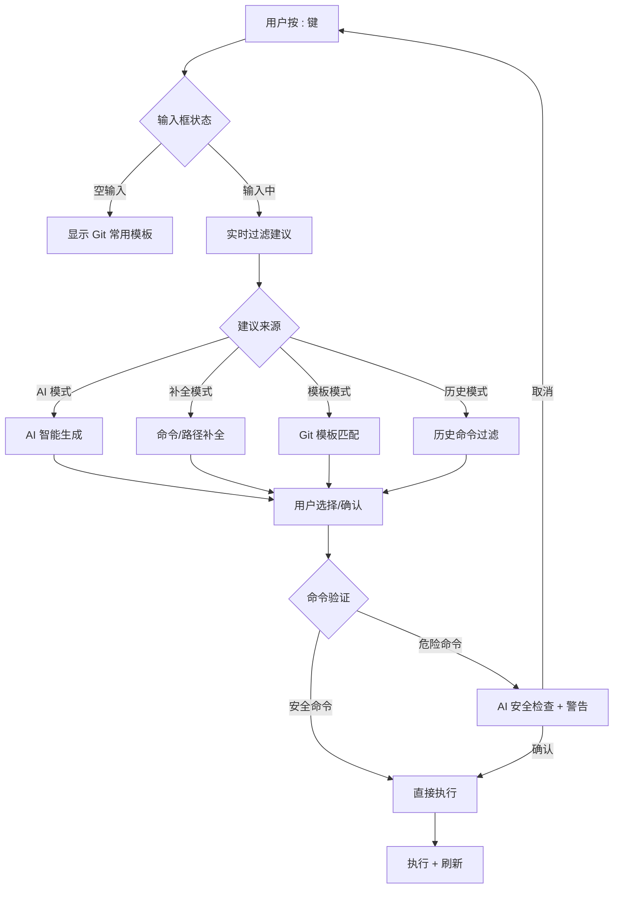

# Shell 命令执行功能重新设计

## 概述

将现有的 `:` Shell 命令功能升级为智能化、多层次的命令执行系统，集成 Git 常用命令模板、智能补全、AI 辅助和优化的用户体验。

---

## 一、核心功能架构

### 1.1 分层建议系统

```
┌─────────────────────────────────────────┐
│  Shell 命令输入框                        │
│  > git com█                             │
└─────────────────────────────────────────┘
         ↓
┌─────────────────────────────────────────┐
│  智能建议面板（分 4 层显示）             │
├─────────────────────────────────────────┤
│ 【AI 建议】 (Ctrl+I 切换)               │
│  ○ git commit -m "..." && git push      │
│    ↳ AI: 基于当前变更自动生成            │
├─────────────────────────────────────────┤
│ 【Git 模板】 (高亮显示)                 │
│  • git commit -m "{message}"            │
│  • git commit --amend --no-edit         │
│  • git commit -a -m "{message}"         │
├─────────────────────────────────────────┤
│ 【补全建议】 (Tab 补全)                 │
│  • git commit                           │
│  • git commit --amend                   │
│  • git commit --fixup                   │
├─────────────────────────────────────────┤
│ 【历史命令】                            │
│  • git commit -m "feat: add feature"    │
│  • git commit --amend -m "fix: bug"     │
└─────────────────────────────────────────┘
```

### 1.2 交互流程



---

## 二、详细功能设计

### 2.1 Git 常用命令模板

#### 分类模板库

```go
type CommandTemplate struct {
    Category    string   // 分类：commit, branch, remote, stash, etc.
    Command     string   // 命令模板，{} 为占位符
    Description string   // 中文描述
    Placeholders []string // 占位符说明
    Icon        string   // 图标标识
    Priority    int      // 优先级（影响排序）
}

var GitCommandTemplates = []CommandTemplate{
    // === Commit 操作 ===
    {
        Category:    "commit",
        Command:     "git commit -m \"{message}\"",
        Description: "提交暂存的更改",
        Placeholders: []string{"message: 提交信息"},
        Icon:        "📝",
        Priority:    10,
    },
    {
        Category:    "commit",
        Command:     "git commit --amend --no-edit",
        Description: "修改最后一次提交（不改消息）",
        Icon:        "✏️",
        Priority:    9,
    },
    {
        Category:    "commit",
        Command:     "git commit -a -m \"{message}\"",
        Description: "提交所有已跟踪文件的更改",
        Placeholders: []string{"message: 提交信息"},
        Icon:        "📦",
        Priority:    8,
    },
    {
        Category:    "commit",
        Command:     "git commit --amend -m \"{message}\"",
        Description: "修改最后一次提交消息",
        Placeholders: []string{"message: 新的提交信息"},
        Icon:        "✏️",
        Priority:    7,
    },

    // === Branch 操作 ===
    {
        Category:    "branch",
        Command:     "git branch {branch-name}",
        Description: "创建新分支",
        Placeholders: []string{"branch-name: 分支名称"},
        Icon:        "🌿",
        Priority:    10,
    },
    {
        Category:    "branch",
        Command:     "git checkout -b {branch-name}",
        Description: "创建并切换到新分支",
        Placeholders: []string{"branch-name: 分支名称"},
        Icon:        "🌿",
        Priority:    9,
    },
    {
        Category:    "branch",
        Command:     "git branch -d {branch-name}",
        Description: "删除已合并的分支",
        Placeholders: []string{"branch-name: 分支名称"},
        Icon:        "🗑️",
        Priority:    5,
    },
    {
        Category:    "branch",
        Command:     "git branch -D {branch-name}",
        Description: "强制删除分支",
        Placeholders: []string{"branch-name: 分支名称"},
        Icon:        "⚠️",
        Priority:    3,
    },

    // === Remote 操作 ===
    {
        Category:    "remote",
        Command:     "git push origin {branch-name}",
        Description: "推送分支到远程",
        Placeholders: []string{"branch-name: 分支名称"},
        Icon:        "⬆️",
        Priority:    10,
    },
    {
        Category:    "remote",
        Command:     "git push --force-with-lease",
        Description: "安全的强制推送",
        Icon:        "⚡",
        Priority:    5,
    },
    {
        Category:    "remote",
        Command:     "git pull --rebase",
        Description: "使用 rebase 方式拉取",
        Icon:        "⬇️",
        Priority:    8,
    },

    // === Stash 操作 ===
    {
        Category:    "stash",
        Command:     "git stash save \"{message}\"",
        Description: "保存当前工作区到 stash",
        Placeholders: []string{"message: stash 描述"},
        Icon:        "💾",
        Priority:    10,
    },
    {
        Category:    "stash",
        Command:     "git stash pop",
        Description: "恢复并删除最近的 stash",
        Icon:        "📤",
        Priority:    9,
    },
    {
        Category:    "stash",
        Command:     "git stash apply stash@{{n}}",
        Description: "应用指定的 stash",
        Placeholders: []string{"n: stash 索引"},
        Icon:        "📋",
        Priority:    5,
    },

    // === Reset/Revert 操作 ===
    {
        Category:    "reset",
        Command:     "git reset HEAD~1",
        Description: "撤销最后一次提交（保留更改）",
        Icon:        "↩️",
        Priority:    8,
    },
    {
        Category:    "reset",
        Command:     "git reset --hard HEAD~1",
        Description: "撤销最后一次提交（丢弃更改）",
        Icon:        "⚠️",
        Priority:    3,
    },
    {
        Category:    "reset",
        Command:     "git revert {commit-hash}",
        Description: "反转指定提交",
        Placeholders: []string{"commit-hash: 提交哈希"},
        Icon:        "🔄",
        Priority:    7,
    },

    // === Log/Diff 操作 ===
    {
        Category:    "log",
        Command:     "git log --oneline --graph --all -n 20",
        Description: "查看图形化提交历史",
        Icon:        "📊",
        Priority:    10,
    },
    {
        Category:    "log",
        Command:     "git log --author=\"{author}\" --oneline",
        Description: "查看指定作者的提交",
        Placeholders: []string{"author: 作者名称"},
        Icon:        "👤",
        Priority:    5,
    },
    {
        Category:    "diff",
        Command:     "git diff HEAD~1",
        Description: "查看与上次提交的差异",
        Icon:        "🔍",
        Priority:    8,
    },

    // === Clean 操作 ===
    {
        Category:    "clean",
        Command:     "git clean -fd",
        Description: "删除未跟踪的文件和目录",
        Icon:        "🧹",
        Priority:    5,
    },
    {
        Category:    "clean",
        Command:     "git clean -fdx",
        Description: "删除未跟踪和忽略的文件",
        Icon:        "⚠️",
        Priority:    2,
    },

    // === Tag 操作 ===
    {
        Category:    "tag",
        Command:     "git tag {tag-name}",
        Description: "创建轻量标签",
        Placeholders: []string{"tag-name: 标签名称"},
        Icon:        "🏷️",
        Priority:    7,
    },
    {
        Category:    "tag",
        Command:     "git tag -a {tag-name} -m \"{message}\"",
        Description: "创建带注释的标签",
        Placeholders: []string{"tag-name: 标签名称", "message: 标签说明"},
        Icon:        "🏷️",
        Priority:    6,
    },
}
```

### 2.2 智能补全机制

#### 2.2.1 命令补全

```go
type CompletionEngine struct {
    // 命令数据库
    GitCommands     []string
    CommonCommands  []string
    Subcommands     map[string][]string
    Flags           map[string][]string

    // 上下文感知
    CurrentBranches []string
    RecentCommits   []string
    RemoteBranches  []string
    Tags            []string
    Files           []string
}

// 补全示例
func (c *CompletionEngine) Complete(input string) []Completion {
    // 解析当前输入
    parts := parseInput(input)

    if len(parts) == 1 {
        // 主命令补全
        return c.completeMainCommand(parts[0])
    }

    if parts[0] == "git" && len(parts) == 2 {
        // Git 子命令补全
        return c.completeGitSubcommand(parts[1])
    }

    // 参数补全（基于上下文）
    return c.completeArguments(parts)
}

// Git 子命令补全
var GitSubcommands = []string{
    "add", "bisect", "branch", "checkout", "cherry-pick", "clean",
    "clone", "commit", "diff", "fetch", "grep", "init", "log",
    "merge", "mv", "pull", "push", "rebase", "reset", "revert",
    "rm", "show", "stash", "status", "tag",
}

// 常用参数补全
var GitFlagCompletions = map[string][]string{
    "commit": {
        "--amend", "--no-edit", "-m", "-a", "--fixup",
        "--signoff", "-S", "--no-verify", "--allow-empty",
    },
    "push": {
        "--force", "--force-with-lease", "--set-upstream",
        "-u", "--tags", "--delete", "--dry-run",
    },
    "checkout": {
        "-b", "-B", "--track", "--no-track", "-f", "--orphan",
    },
    "rebase": {
        "-i", "--interactive", "--continue", "--abort", "--skip",
        "--onto", "--autosquash",
    },
}
```

#### 2.2.2 上下文补全

```go
// 根据当前仓库状态动态补全
func (c *CompletionEngine) GetContextualCompletions(cmd string, arg string) []Completion {
    switch {
    case isCheckoutCommand(cmd):
        // 补全分支名
        return c.completeBranchNames(arg)

    case isMergeCommand(cmd):
        // 补全可合并的分支
        return c.completeMergeableBranches(arg)

    case isResetCommand(cmd):
        // 补全提交哈希
        return c.completeCommitHashes(arg)

    case isFileCommand(cmd):
        // 补全文件路径
        return c.completeFilePaths(arg)

    case isRemoteCommand(cmd):
        // 补全远程名称
        return c.completeRemoteNames(arg)
    }

    return nil
}
```

### 2.3 AI 智能辅助

#### 2.3.1 自然语言转命令

```go
// AI 命令生成（增强版）
func (self *AIHelper) GenerateShellCommand(userIntent string, repoContext string) ([]CommandSuggestion, error) {
    prompt := fmt.Sprintf(
        `你是一个 Git 命令专家。根据用户意图生成精确的 shell 命令。

规则：
1. 输出 JSON 数组，每个元素包含：
   - "command": 完整的可执行命令
   - "explanation": 命令的中文解释
   - "risk_level": 风险等级 (safe/medium/dangerous)
   - "alternatives": 替代命令（可选）

2. 优先使用安全的命令
3. 对于危险操作，提供更安全的替代方案
4. 一次可以返回多个相关命令供用户选择

仓库状态：
%s

用户意图：%s

示例输出：
[
  {
    "command": "git commit -m \"feat: add feature\"",
    "explanation": "提交当前暂存的更改",
    "risk_level": "safe"
  },
  {
    "command": "git reset --soft HEAD~1",
    "explanation": "撤销最后一次提交但保留更改",
    "risk_level": "medium",
    "alternatives": "git commit --amend (如果只是想修改提交消息)"
  }
]
`,
        repoContext,
        userIntent,
    )

    result, err := self.c.AI.Complete(ctx, prompt)
    if err != nil {
        return nil, err
    }

    var suggestions []CommandSuggestion
    if err := json.Unmarshal([]byte(result.Content), &suggestions); err != nil {
        return nil, err
    }

    return suggestions, nil
}

type CommandSuggestion struct {
    Command      string   `json:"command"`
    Explanation  string   `json:"explanation"`
    RiskLevel    string   `json:"risk_level"` // safe, medium, dangerous
    Alternatives string   `json:"alternatives,omitempty"`
}
```

#### 2.3.2 命令解释和安全检查

```go
// AI 命令解释
func (self *AIHelper) ExplainCommand(command string) (string, error) {
    prompt := fmt.Sprintf(
        `解释这个 Git 命令会做什么，用简洁的中文说明：

命令：%s

请说明：
1. 这个命令的作用
2. 会产生什么影响
3. 是否有风险（如果有，说明风险点）
4. 建议或注意事项

保持回答简洁（3-5 行）。`,
        command,
    )

    result, err := self.c.AI.Complete(ctx, prompt)
    return result.Content, err
}

// 危险命令检测
var DangerousPatterns = []struct {
    Pattern string
    Risk    string
}{
    {"git reset --hard", "将丢失未提交的更改"},
    {"git clean -fdx", "将删除所有未跟踪和忽略的文件"},
    {"git push --force", "可能覆盖远程分支历史"},
    {"rm -rf", "危险：递归删除文件"},
    {"git reflog expire", "将永久删除 reflog 记录"},
}

func (self *AIHelper) CheckCommandSafety(command string) (bool, string) {
    for _, pattern := range DangerousPatterns {
        if strings.Contains(command, pattern.Pattern) {
            return false, pattern.Risk
        }
    }
    return true, ""
}
```

### 2.4 UI/UX 优化

#### 2.4.1 增强输入框

```go
type EnhancedShellPrompt struct {
    // 多行输入支持
    MultiLineSupport bool

    // 实时预览
    ShowPreview bool

    // 语法高亮
    SyntaxHighlight bool

    // 快捷键
    Shortcuts map[string]func()
}

// 快捷键映射
var ShellCommandShortcuts = map[string]string{
    "Tab":       "补全/切换补全项",
    "Ctrl+I":    "切换 AI 模式",
    "Ctrl+E":    "解释当前命令",
    "Ctrl+T":    "显示模板列表",
    "Ctrl+H":    "显示历史",
    "Ctrl+Space":"强制刷新建议",
    "Esc":       "取消",
    "Enter":     "执行",
    "Ctrl+Enter":"添加新行（多行模式）",
}
```

#### 2.4.2 分类显示

```go
// 建议分类显示
type SuggestionCategory struct {
    Name        string
    Icon        string
    Suggestions []Suggestion
    Collapsed   bool // 可折叠
}

var SuggestionCategories = []SuggestionCategory{
    {
        Name: "AI 建议",
        Icon: "🤖",
        Suggestions: aiSuggestions,
        Collapsed: false,
    },
    {
        Name: "Git 常用模板",
        Icon: "⭐",
        Suggestions: templateSuggestions,
        Collapsed: false,
    },
    {
        Name: "智能补全",
        Icon: "💡",
        Suggestions: completionSuggestions,
        Collapsed: false,
    },
    {
        Name: "历史命令",
        Icon: "📜",
        Suggestions: historySuggestions,
        Collapsed: true, // 默认折叠
    },
}
```

---

## 三、实现优先级

### P0 - 核心功能（立即实施）

1. **Git 命令模板库**
   - ✅ 定义 30+ 常用 Git 命令模板
   - ✅ 分类组织（commit, branch, remote, etc.）
   - ✅ 占位符系统 `{name}` 自动提示填写

2. **基础补全机制**
   - ✅ Git 子命令补全
   - ✅ 常用参数补全
   - ✅ 分支名/文件名补全

3. **AI 集成**
   - ✅ 自然语言转命令
   - ✅ 命令安全检查
   - ✅ 危险命令警告

### P1 - 增强功能

4. **上下文感知补全**
   - 动态获取分支列表
   - 提交哈希补全
   - 文件路径补全

5. **命令解释**
   - AI 解释命令作用
   - 显示预期结果
   - 风险提示

6. **历史优化**
   - 按频率排序
   - 智能去重
   - 分类标签

### P2 - 高级功能

7. **多行命令支持**
   - 脚本编辑
   - 管道操作
   - 变量替换

8. **模板自定义**
   - 用户自定义模板
   - 模板导入/导出
   - 团队共享模板

9. **命令收藏夹**
   - 标记常用命令
   - 快速访问
   - 组织分类

---

## 四、技术实现细节

### 4.1 文件结构

```
pkg/gui/controllers/
├── shell_command_action.go          # 现有文件（增强）
├── helpers/
│   ├── shell_command_helper.go      # 新增：核心逻辑
│   ├── command_templates.go         # 新增：模板库
│   ├── command_completion.go        # 新增：补全引擎
│   └── ai_command_helper.go         # 新增：AI 命令辅助
```

### 4.2 数据结构

```go
// 增强的 ShellCommandAction
type EnhancedShellCommandAction struct {
    c *ControllerCommon

    // 子系统
    templateEngine   *TemplateEngine
    completionEngine *CompletionEngine
    aiHelper         *AICommandHelper

    // 状态
    aiMode           bool
    currentCategory  string
    selectedTemplate *CommandTemplate
}

// 建议项
type Suggestion struct {
    Type        string   // "template", "completion", "history", "ai"
    Command     string
    Description string
    Icon        string
    Score       float64  // 相关性评分
    RiskLevel   string   // "safe", "medium", "dangerous"
    Metadata    map[string]interface{}
}

// 补全结果
type Completion struct {
    Text        string
    Description string
    Type        string // "command", "flag", "branch", "file", etc.
    Context     string // 上下文提示
}
```

### 4.3 核心算法

```go
// 智能建议排序算法
func (self *EnhancedShellCommandAction) RankSuggestions(
    input string,
    suggestions []Suggestion,
) []Suggestion {

    for i := range suggestions {
        score := 0.0

        // 1. 前缀匹配得分（50%）
        if strings.HasPrefix(suggestions[i].Command, input) {
            score += 0.5
        }

        // 2. 模糊匹配得分（30%）
        score += 0.3 * fuzzyMatchScore(input, suggestions[i].Command)

        // 3. 类型优先级（20%）
        score += 0.2 * getTypePriority(suggestions[i].Type)

        // 4. 使用频率加成
        if suggestions[i].Type == "history" {
            score += 0.1 * getUsageFrequency(suggestions[i].Command)
        }

        suggestions[i].Score = score
    }

    // 按得分降序排序
    sort.Slice(suggestions, func(i, j int) bool {
        return suggestions[i].Score > suggestions[j].Score
    })

    return suggestions
}

// 类型优先级
func getTypePriority(suggestionType string) float64 {
    priorities := map[string]float64{
        "ai":         1.0,  // AI 建议优先级最高
        "template":   0.8,
        "completion": 0.6,
        "history":    0.4,
    }
    return priorities[suggestionType]
}
```

---

## 五、用户交互流程

### 场景 1：新手用户 - 浏览模板

```
用户：按 ":"
系统：显示分类模板列表

┌─────────────────────────────────────┐
│ Shell 命令                          │
│ > _                                 │
├─────────────────────────────────────┤
│ ⭐ Git 常用模板（按 Ctrl+T 浏览全部）│
│                                     │
│ 📝 Commit 操作                      │
│  • git commit -m "{message}"        │
│  • git commit --amend --no-edit     │
│                                     │
│ 🌿 Branch 操作                      │
│  • git checkout -b {branch-name}    │
│  • git branch -d {branch-name}      │
│                                     │
│ ⬆️ Push/Pull                         │
│  • git push origin {branch-name}    │
│  • git pull --rebase                │
└─────────────────────────────────────┘

用户：选择模板
系统：自动填充并高亮占位符
> git commit -m "{message}"
              ^^^^^^^^^^^
              光标定位在此，等待输入
```

### 场景 2：熟练用户 - 快速补全

```
用户：输入 "git com"
系统：实时显示补全

┌─────────────────────────────────────┐
│ Shell 命令                          │
│ > git com█                          │
├─────────────────────────────────────┤
│ 💡 补全建议（Tab 补全）             │
│  • git commit                       │
│  • git commit -m                    │
│  • git commit --amend               │
│                                     │
│ ⭐ 匹配的模板                        │
│  • git commit -m "{message}"        │
│  • git commit --amend --no-edit     │
└─────────────────────────────────────┘

用户：按 Tab
系统：补全为 "git commit"

用户：继续输入 " -"
系统：显示参数补全
│ 💡 参数建议                         │
│  • -m, --message                    │
│  • --amend                          │
│  • -a, --all                        │
│  • --no-verify                      │
```

### 场景 3：AI 辅助模式

```
用户：按 ":" 然后 Ctrl+I 切换到 AI 模式
系统：输入框标题变为 "🤖 AI 命令助手"

┌─────────────────────────────────────┐
│ 🤖 AI 命令助手（自然语言）          │
│ > 撤销最后一次提交但保留更改█       │
└─────────────────────────────────────┘

用户：按 Enter
系统：AI 分析并生成建议

┌─────────────────────────────────────┐
│ 🤖 AI 建议                          │
│                                     │
│ ✅ 推荐方案（安全）                 │
│  git reset --soft HEAD~1            │
│  说明：撤销提交但保留暂存区的更改   │
│                                     │
│ ⚠️ 替代方案（中等风险）             │
│  git reset --mixed HEAD~1           │
│  说明：撤销提交并取消暂存           │
│                                     │
│ ❌ 不推荐（危险）                   │
│  git reset --hard HEAD~1            │
│  说明：将丢失所有未提交的更改       │
│  ⚠️ 建议先 stash 保存              │
└─────────────────────────────────────┘

用户：选择并按 Ctrl+E
系统：显示详细解释
┌─────────────────────────────────────┐
│ 命令解释                            │
│                                     │
│ git reset --soft HEAD~1             │
│                                     │
│ • 移动 HEAD 指针到上一个提交        │
│ • 保留工作区和暂存区的所有更改      │
│ • 适合修正提交内容或消息            │
│ • 风险：无（可安全撤销）            │
│                                     │
│ 按 Enter 执行，Esc 取消             │
└─────────────────────────────────────┘
```

---

## 六、配置选项

```yaml
# config.yml
gui:
  shellCommand:
    # 启用 AI 辅助
    enableAI: true

    # 默认显示模板
    showTemplatesByDefault: true

    # 自动补全
    autoComplete: true

    # 补全延迟（毫秒）
    completionDelay: 100

    # 历史记录数量
    maxHistorySize: 1000

    # 危险命令确认
    confirmDangerousCommands: true

    # 模板分类显示
    groupTemplatesByCategory: true

    # 语法高亮
    syntaxHighlight: true

    # 默认模式（normal/ai）
    defaultMode: "normal"
```

---

## 七、翻译键

```go
// 新增翻译键
ShellCommandEnhanced                 string
ShellCommandAIMode                   string
ShellCommandTemplateMode             string
ShellCommandCompletionMode           string
ShellCommandExplain                  string
ShellCommandDangerousWarning         string
ShellCommandAISuggestions            string
ShellCommandGitTemplates             string
ShellCommandCompletions              string
ShellCommandHistory                  string
ShellCommandSwitchToAI               string
ShellCommandShowTemplates            string
ShellCommandToggleCategories         string
ShellCommandRiskLevelSafe            string
ShellCommandRiskLevelMedium          string
ShellCommandRiskLevelDangerous       string
```

---

## 八、性能考虑

1. **建议缓存**
   - 缓存模板列表（静态数据）
   - 缓存补全结果（5 秒过期）
   - 历史命令索引

2. **异步加载**
   - AI 建议异步获取
   - 文件路径异步扫描
   - 不阻塞输入响应

3. **智能限制**
   - 最多显示 20 条建议
   - 历史命令去重合并
   - 长命令截断显示

---

## 九、后续扩展方向

1. **团队协作**
   - 共享命令模板库
   - 导出/导入配置
   - 最佳实践推荐

2. **命令录制**
   - 记录命令序列
   - 转换为脚本
   - 批量执行

3. **集成外部工具**
   - GitHub CLI 集成
   - Docker 命令支持
   - 项目特定命令

4. **机器学习优化**
   - 学习用户习惯
   - 个性化推荐
   - 智能纠错

---

这是一个完整的设计方案。是否立即开始实施 P0 功能？
